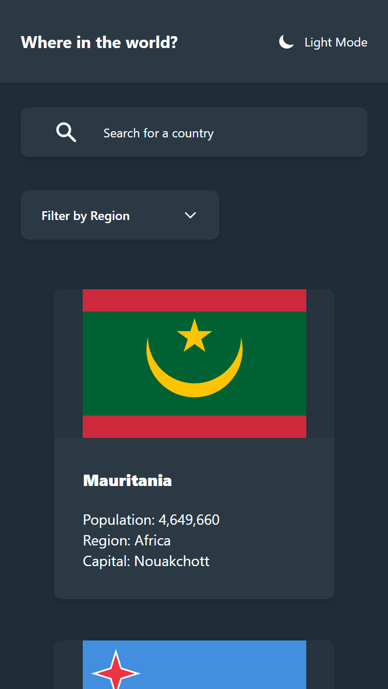
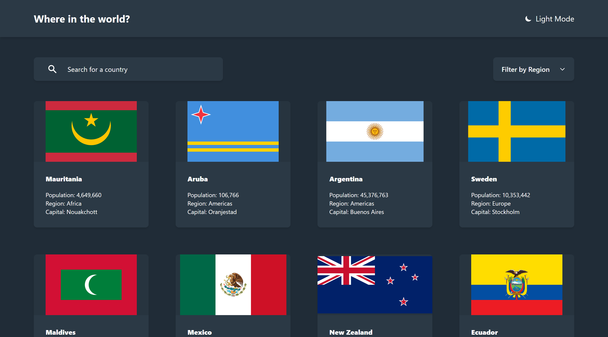
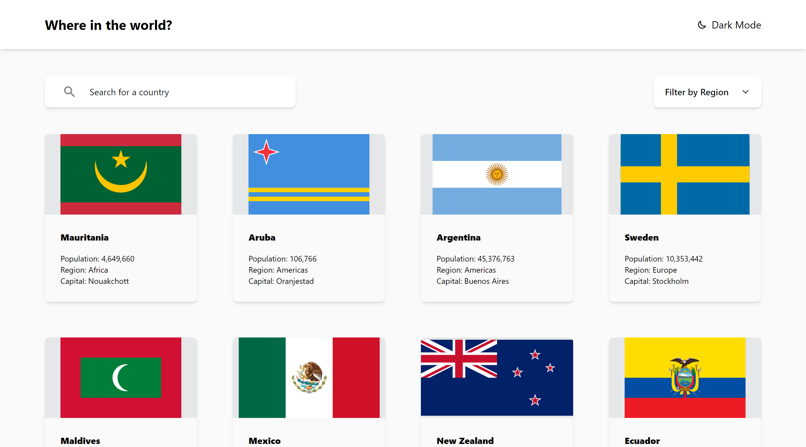
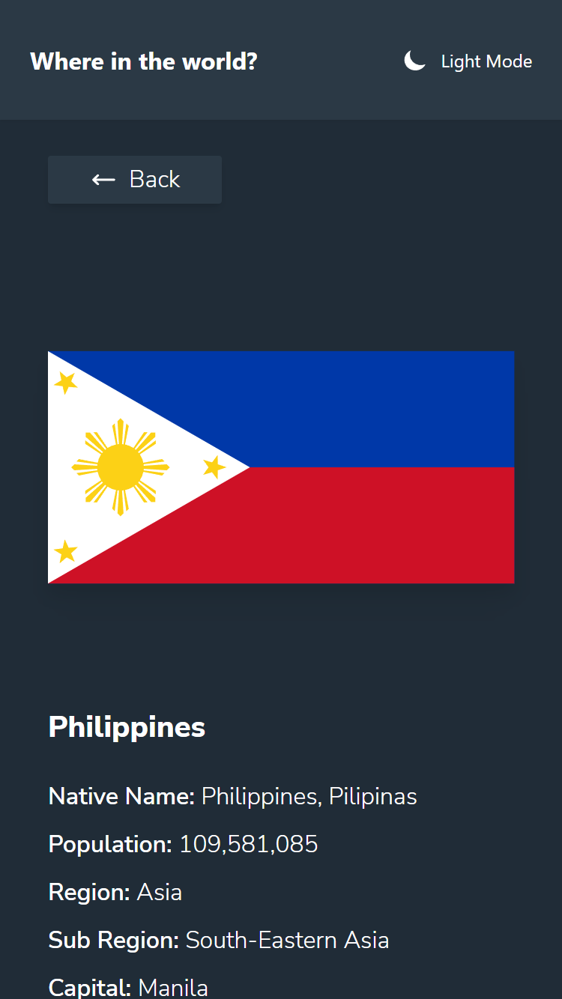
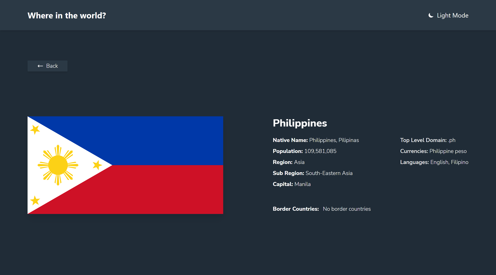
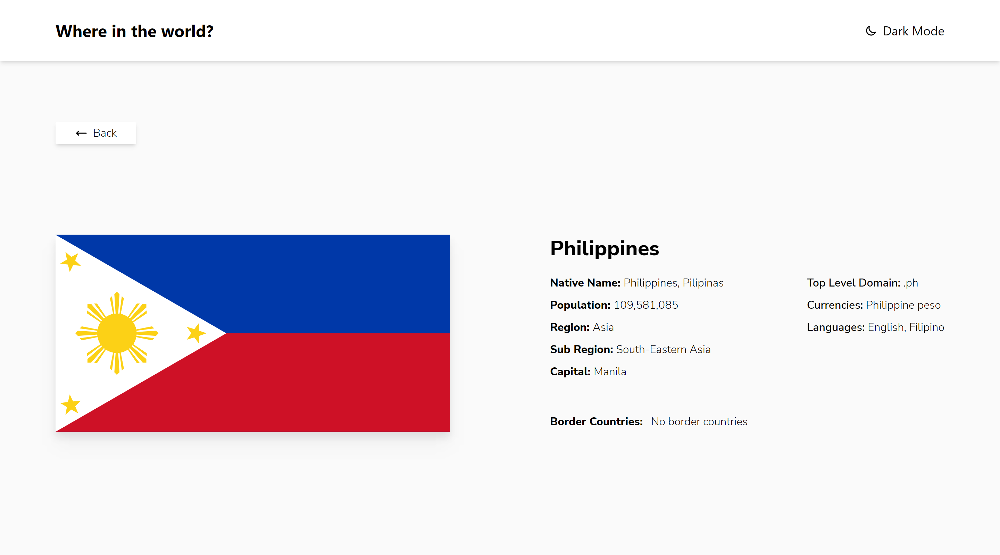

# Frontend Mentor - REST Countries API with color theme switcher solution

This is a solution to the [REST Countries API with color theme switcher challenge on Frontend Mentor](https://www.frontendmentor.io/challenges/rest-countries-api-with-color-theme-switcher-5cacc469fec04111f7b848ca). Frontend Mentor challenges help you improve your coding skills by building realistic projects. 

## Table of contents

- [Overview](#overview)
  - [The challenge](#the-challenge)
  - [Screenshot](#screenshot)
  - [Links](#links)
- [My process](#my-process)
  - [Built with](#built-with)
  - [What I learned](#what-i-learned)
- [Author](#author)


## Overview

### The challenge

Users should be able to:

- See all countries from the API on the homepage
- Search for a country using an `input` field
- Filter countries by region
- Click on a country to see more detailed information on a separate page
- Click through to the border countries on the detail page
- Toggle the color scheme between light and dark mode *(optional)*

### Screenshot

1. Home mobile view dark mode


2. Home Desktop view dark mode


3. Home Desktop view light mode


4. Home Desktop view light mode


5. Home Desktop view light mode


6. Home Desktop view light mode


### Links

- Solution URL: [Add solution URL here](https://your-solution-url.com)
- Live Site URL: [Add live site URL here](https://your-live-site-url.com)

## My process

### Built with

- HTML5
- CSS
- Mobile-first workflow
- next-themes
- [React](https://reactjs.org/) - JS library
- [Next.js](https://nextjs.org/) - React framework
- [TailwindCSS](https://tailwindcss.com/) - CSS Framework
- [REST Countries API](https://restcountries.com) - Countries API

### What I learned

1. Nextjs getStaticProps
```js
  export const getStaticProps = async() => {

    const res = await fetch(`https://restcountries.com/v3.1/all`)
    const data = await res.json()
    return {
      props: {
        countriesData: data || []
      }
    }
  }
```

2. Nextjs getStaticPaths
```js
  export const getStaticPaths = async() => {
  const res = await fetch(`https://restcountries.com/v3.1/all`)
  const data = await res.json()
  
  const paths = data.map(country => {
    return {
      params: {
        countryName: `${country.name?.common}`
      }
    }
  })

  return {
    paths,
    fallback: 'blocking',
  }
}
```
3. Using Object.values to get some data in API response
```js
  Object.values(countryData.tld)
```


## Author

Frontend Mentor - [sezaru-dev](https://www.frontendmentor.io/profile/sezaru-dev)